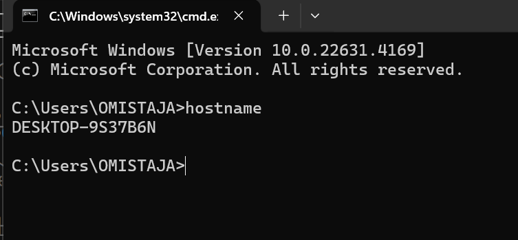

## Step 1: Install CHOCOLATEY

Chocolatey is a popular package manager for Windows that simplifies the process of installing, updating, and managing software applications. It allows users to automate the installation of a wide range of software with a single command, making it efficient and convenient. Chocolatey provides access to a vast repository of pre-packaged software packages, which can be easily installed, updated, or removed using command-line instructions. This tool streamlines software management on Windows systems, enhancing productivity and reducing the manual effort required for software maintenance.

???+ warning "Requirements"
    * Windows 7 or newer version of Windows Operating System (Recommended Windows 10 or 11)
    * PowerShell v2+
    * .NET Framework 4+ 

???+ info "Installation Process"
    * Start Powershell with Administrator rights (Run as Administrator)
    If you already have choco installed in your device, run the following command in your powershell 

!!! danger "This will remove chocolatey from your computer! For re-installing only!"
    ```powershell title="Powershell as Administrator"
    rm -Path "C:\ProgramData\chocolatey" -Recurse -Force
    rm -Path "C:\ProgramData\ChocolateyHttpCache" -Recurse -Force
    ```
**Lets understand what you did with above command:** 

- `#!powershell rm`: It deletes files or directories in this case it deletes the chocolatey directory.
- `#!powershell -erroraction 'silentlycontinue'`: This part of the command tells PowerShell to continue executing the script without displaying an error message if the removal encounters an error (e.g., if the directory doesn't exist).

**Run the following command in Powershell to install CHOCOLATEY**

```powershell
Set-ExecutionPolicy Bypass -Scope Process -Force; iwr https://community.chocolatey.org/install.ps1 -UseBasicParsing | iex
```

## Step 2: Programs/Apps Installation

After successfully installing the Chocolatey package manager, you can use it to install multiple apps simultaneously. This saves you significant time compared to installing each app individually. 

***The list of apps that you are going to install is as below:*** <br>

> powershell-core, git, vscode, putty,firefox, greenshot,google-drive-file-stream, googlechrome notepadplusplus, winscp, 7zip,  paint.net, windirstat, zoom, sudo, vmrc, vmware-horizon-client, github-desktop, docker-desktop & obs-studio powertoys

***To install the above mentioned programs run the following script***

```powershell
choco install powershell-core git vscode putty greenshot notepadplusplus winscp 7zip paint.net windirstat zoom sudo vmrc vmware-horizon-client github-desktop obs-studio docker-desktop google-drive-file-stream googlechrome curl powertoys -y


Installed softwares
7-zip
Firfox
Notepad ++
Powershell 7
Visual Studio Code
VLC

```
Set-ExecutionPolicy Bypass -Scope Process -Force; iwr https://community.chocolatey.org/install.ps1 -UseBasicParsing | iex

choco install powershell-core git vscode putty greenshot notepadplusplus winscp 7zip paint.net windirstat zoom sudo vmrc vmware-horizon-client github-desktop obs-studio docker-desktop google-drive-file-stream googlechrome curl powertoys -y

Usefull VSCode addons
code --install-extension ms-vscode.powershell
code --install-extension vsls-contrib.gistfs
code --install-extension ms-vscode-remote.remote-containers
code --install-extension ms-azuretools.vscode-docker
code --install-extension ms-vscode-remote.vscode-remote-extensionpack
code --install-extension GitHub.copilot
code --install-extension GitHub.vscode-pull-request-github
```

